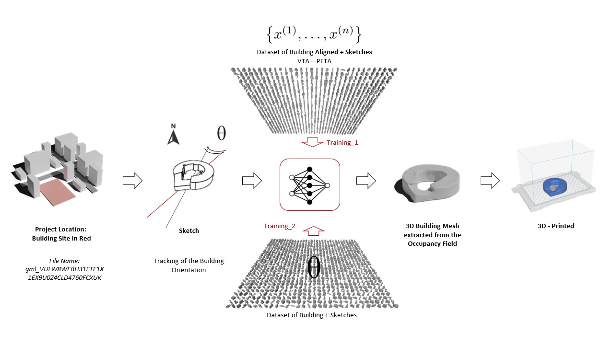
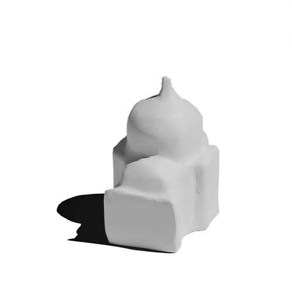
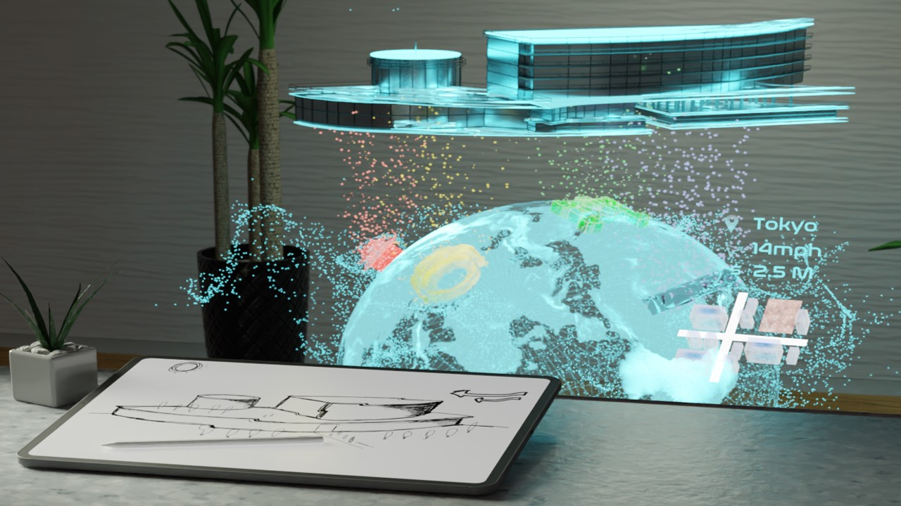

# Vitruvio: Conditional Variational Autoencoder (CVAE) to Generate Building Meshes via Single Perspective Sketches

<p align="center">

</p>

This method allows designers to automatically generate 3D representations in real-time based on their initial sketches and thus communicate effectively and intuitively to the client. Vitruvio adapts the Occupancy Network to perform single view reconstruction (SVR), a technique for creating 3D representations from a single image. Vitruvio achieves: (1) an 18\% increase in the reconstruction accuracy and (2) a 26\% reduction in the inference time compared to the Occupancy Network on one thousand buildings provided by the New York municipality. This research investigates the effect that the building orientation has on the reconstruction quality, discovering that Vitruvio can capture fine-grain details in complex buildings when their native orientation is preserved during training, as opposed to the SVR's standard practice that aligns every building to its canonical pose.

## Contributions


<p align="center">

</p>

- We introduced learning-based method for single perspective sketch-to-3D applications in the Architecture Engineering and Construction (AEC) industry. 
- We adapted a previous state-of-the-art Conditional Variational Autoencoder (Occupancy Network) to scalable datasets. 
- We showed qualitatively and quantitatively how the building orientation affects the reconstruction. 

### Orientation

 | We need to consider the orientation of the building for this sketch to 3D method. Use this [script](https://github.com/CDInstitute/Vitruvio/blob/38f7c596a24ba71498723475bf2778d19003010b/align.py) to center and align the dataset, while tracking the orientation. Make sure to install all the packages in your environemnt and use `python align.py --objs '<FOLDER PATH>' `
------------ | -------------

## Dataset

You can generate your own dataset taking the .obj files from RealCity3D and run the code in Occupancy Network to get the occupancy field. For any other inqueries please reach out to Alberto Tono using atono@stanford.edu


## Main References and Material

This repository uses the code from the paper
- [Occupancy Networks - Learning 3D Reconstruction in Function Space](https://avg.is.tuebingen.mpg.de/publications/occupancy-networks) as a baseline. 
- [Paper Arxiv 2021 submission](https://arxiv.org/abs/2210.13634) 
- [Dataset, Weights Request & Contribution Form](https://forms.gle/JEUW8kpDz2pmtyYv5) [5GB]
- [Dataset Split and Orientation Tracker File](https://drive.google.com/file/d/1CA-ck2-E5H8GrK6jvVzKNKVTyM4gCo4Q/view?usp=share_link) [26kb]


## Acknowledgement 

[CIFE Stanford Seed Grant 2022/23](https://cife.stanford.edu/neural-design-phase-bridging-schematic-and-development-phases), [CIFE Stanford Seed Grant 2023/24](https://cife.stanford.edu/esketch-multimodal-generative-ai-design-interface-and-human-centered-approach-neural-design-phase), [Stanford Human-Centered Artificial Intelligence - HAI](https://hai.stanford.edu/people/alberto-tono), NVIDIA Omniverse Team. 

 | At the beginning of a project, architects convey design ideas via quick 2D diagrams, front views, floor plans, and sketches. Consequently, many stakeholders have difficulty visualizing the 3D representation of the building mass, leading to varied interpretations thus inhibiting a shared understanding of the design. To alleviate the challenge, this paper proposes a deep learning-based method, Vitruvio, for creating a 3D model from a single perspective sketch
------------ | -------------

## Cite 

```
@article{TONO2024105498,
        title = {Vitruvio: Conditional variational autoencoder to generate building meshes via single perspective sketches},
        journal = {Automation in Construction},
        volume = {166},
        pages = {105498},
        year = {2024},
        issn = {0926-5805},
        doi = {https://doi.org/10.1016/j.autcon.2024.105498},
        url = {https://www.sciencedirect.com/science/article/pii/S0926580524002346},
        author = {Alberto Tono and Heyaojing Huang and Ashwin Agrawal and Martin Fischer},
        keywords = {Artificial intelligence, Neural-aided design, Deep generative design, Deep generative modeling, Conditional variational autoencoder, Sketch-based modeling},
}
```
